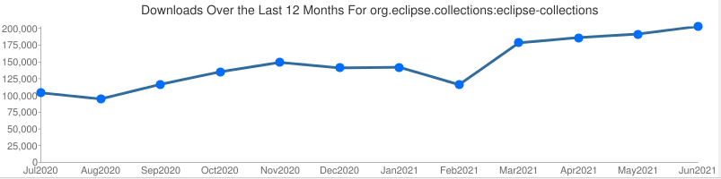

:icons: font

== Eclipse Collection Today

* Stats
** link:https://projects.eclipse.org/projects/technology.collections/who[2 Project Leads, 6 Committers]
** link:https://github.com/eclipse/eclipse-collections/graphs/contributors[80+ Contributors]
** Monthly Downloads:
** 
* OpenJDK
** Member of https://wiki.openjdk.java.net/display/quality/Quality+Outreach[OpenJDK Quality Outreach program]
*** Mentioned in link:https://blogs.oracle.com/java-platform-group/the-arrival-of-java-16[Arrival of Java 16]
*** Mentioned in link:https://blogs.oracle.com/java-platform-group/the-arrival-of-java-14[Arrival of Java 14]
** Reported issue in https://stuartmarks.wordpress.com/2020/09/22/incompatibilities-with-jdk-15-charsequence-isempty/[JDK 15 with CharSequence]
* Links:
** link:https://www.eclipse.org/collections/[Website] - Translated to 11 languages by contributors
** link:https://blogs.oracle.com/javamagazine/the-top-25-greatest-java-apps-ever-written[Java Magazine: The 25 greatest Java apps ever written]
** link:https://blogs.oracle.com/javamagazine/finance-quant-forex-java16[Java Magazine: Java still rocks the finance industry]
* Releases
** Current Release: https://github.com/eclipse/eclipse-collections/releases/tag/10.4.0[10.4]
** Planned Major Release: 11.0 release soon after JDK 17 released (October 2021)

---

link:./00_toc.adoc[TOC] /
link:02_background.adoc[Intro] /
link:./04_ec_top10.adoc[Eclipse Collections Top 10]
