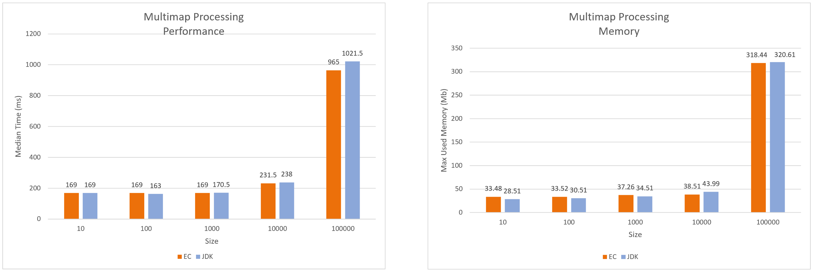
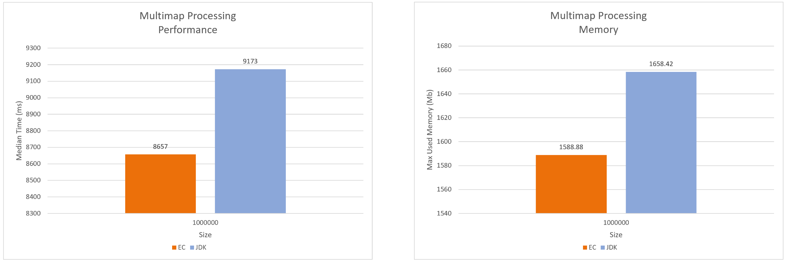

:icons: font

=== Person Dataset: Multimap based Comparison (JDK-8)

[#img-person-multimap-10-100_000-jdk8]
.Person Dataset: Multimap based Comparison 10 to 100,000 elements (JDK-8)

[#img-person-multimap-1_000_000-jdk8]
.Person Dataset: Multimap based Comparison 1,000,000 elements (JDK-8)

_Timing measured as a median over 50 iterations_

_Memory measured as the max heap size found on Visual VM_

_lower the numbers the better_

link:./00_toc.adoc[TOC] /
link:./24_comparison_code_compare_maps_jdk.adoc[Compare Maps: JDK] /
link:./26_measurements_person_dataset_multimaps_jdk11.adoc[Measurements: Person Dataset - Multimaps (JDK-11)]

