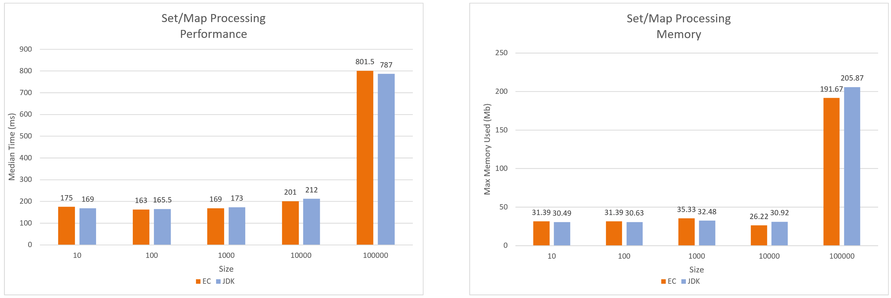
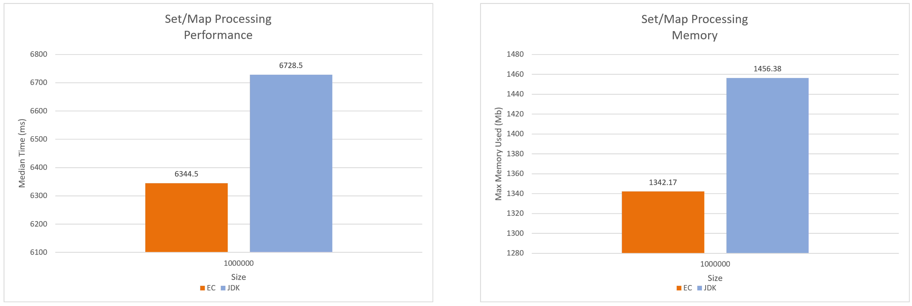

:icons: font

=== Person Dataset: Sets/Maps based Comparison (JDK-8)

[#img-person-sets-maps-10-100_000-jdk8]
.Person Dataset: Sets/Maps based Comparison 10 to 100,000 elements (JDK-8)

[#img-person-sets-maps-1_000_000-jdk8]
.Person Dataset: Sets/Maps based Comparison 1,000,000 elements (JDK-8)

_Timing measured as a median over 50 iterations_

_Memory measured as the max heap size found on Visual VM_

_lower the numbers the better_

link:./00_toc.adoc[TOC] /
link:./28_measurements_reservation_dataset_multimaps_jdk11.adoc[Measurements: Reservation Dataset - Multimaps (JDK-11)] /
link:./30_measurements_person_dataset_sets_maps_jdk11.adoc[Measurements: Person Dataset - Sets/Maps (JDK-11)]

