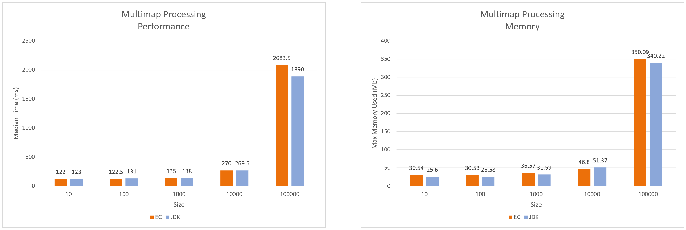
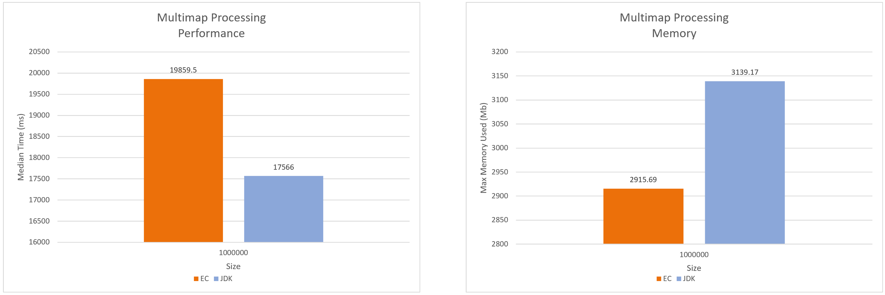

:icons: font

=== Reservation Dataset: Multimap based Comparison (JDK-11)

[#img-reservation-multimap-10-100_000-jdk11]
.Reservation Dataset: Multimap based Comparison 10 to 100,000 elements (JDK-11)

[#img-reservation-multimap-1_000_000-jdk11]
.Reservation Dataset: Multimap based Comparison 1,000,000 elements (JDK-11)

_Timing measured as a median over 50 iterations_

_Memory measured as the max heap size found on Visual VM_

_lower the numbers the better_

link:./00_toc.adoc[TOC] /
link:./27_measurements_person_dataset_multimaps_jdk11.adoc[Measurements: Person Dataset - Multimaps (JDK-11)] /
link:./31_measurements_person_dataset_sets_maps_jdk11.adoc[Measurements: Person Dataset - Sets/Maps (JDK-11)]
